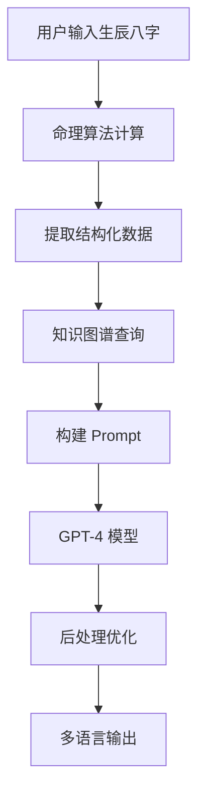

# AI 占卜技术实现深度解析

::: info 📖 阅读信息
**发布时间：** 2025-11-06  
**阅读时长：** 约 15 分钟  
**难度级别：** 🔥🔥🔥 中高级  
**标签：** AI · OpenAI · GPT-4 · Prompt Engineering
:::

## 引言

天机爻作为一个 AI 驱动的命理分析平台，其核心竞争力在于如何让 AI 既懂传统命理，又能提供个性化、温暖的解读。本文将深入探讨我们的 AI 技术实现方案。

## 技术挑战

### 1. 专业性 vs 可读性

传统命理术语晦涩难懂：

```
❌ "日主甲木生于丑月，月令土旺克身，喜水木扶身..."
✅ "你出生在冬季末尾，像一棵等待春天的树木，需要水分的滋养..."
```

**解决方案：** Prompt 工程 + Few-shot Learning

### 2. 准确性 vs 创造性

既要保证命理分析准确，又要提供个性化表达：

- **准确性**：基于结构化命理数据
- **创造性**：GPT 模型的语言生成能力

**解决方案：** 分层 Prompt 设计

### 3. 速度 vs 成本

每次 AI 解读需要调用 OpenAI API：

- GPT-4 Turbo: ~$0.08/次
- 响应时间: 3-5 秒

**解决方案：** 智能缓存 + 流式输出

## 核心技术架构

### 系统流程图



### 数据流转

```typescript
// 1. 用户输入
const input = {
  birthDate: '1990-01-15',
  birthTime: '14:30',
  gender: 'male',
};

// 2. 命理计算
const chart = calculateBaziChart(input);
// 输出：
// {
//   dayMaster: '甲',
//   elements: { metal: 3, wood: 2, water: 1, fire: 1, earth: 3 },
//   pattern: '身弱格',
//   usefulGod: '水',
// }

// 3. 知识检索
const knowledge = await retrieveKnowledge('甲木日主 身弱格');
// 输出：相关命理理论、历史案例

// 4. Prompt 构建
const prompt = buildPrompt(chart, knowledge);

// 5. AI 生成
const interpretation = await generateInterpretation(prompt);
```

## Prompt 工程详解

### 系统 Prompt（角色设定）

```typescript
const systemPrompt = `
你是一位精通中国传统命理学的 AI 大师，专业于八字分析。

【核心能力】
1. 深刻理解天干地支、五行生克、格局用神等传统理论
2. 能够将晦涩的命理术语转化为现代化、易懂的语言
3. 提供温暖、富有同理心的解读，避免消极负面表述

【解读风格】
- 专业但不做作，准确但不绝对
- 温暖而真诚，鼓励而务实
- 既指出潜力，也提示风险
- 提供具体的、可操作的建议

【禁忌】
- 不使用"死亡"、"破产"、"离婚"等极端负面词汇
- 不做绝对化预测（如"一定会"、"永远不会"）
- 不脱离命理理论进行臆测
- 不涉及医疗、法律等专业领域建议
`;
```

### 用户 Prompt（任务描述）

```typescript
function buildUserPrompt(chart: BaziChart, knowledge: string[]) {
  return `
请分析以下八字命盘，提供专业而温暖的解读：

【命盘信息】
- 日主：${chart.dayMaster}（${chart.dayMasterElement}）
- 五行分布：金${chart.elements.metal} 木${chart.elements.wood} 水${chart.elements.water} 火${chart.elements.fire} 土${chart.elements.earth}
- 格局：${chart.pattern}
- 用神：${chart.usefulGod}

【相关命理知识】
${knowledge.join('\n')}

【解读要求】
请从以下 5 个维度提供解读，每个维度 150-200 字：

1. 🎨 **性格特点**
   - 基于日主和五行分析核心性格
   - 指出优势特质与潜在盲点
   - 用生动的比喻（如"像春天的树木"）

2. 💼 **事业发展**
   - 适合的职业方向（3-5个具体领域）
   - 事业运势的周期性变化
   - 职场建议

3. ❤️ **感情婚姻**
   - 感情模式与偏好
   - 理想伴侣类型
   - 感情建议

4. 🏥 **健康养生**
   - 需要注意的健康部位（基于五行）
   - 养生建议（饮食、运动、作息）

5. 💡 **行动建议**
   - 3条具体的、可执行的建议
   - 每条建议包含"为什么"和"怎么做"

【语言风格】
- 第二人称（"你"）直接对话
- 温暖、鼓励、真诚
- 避免命理术语，用现代语言表达
- 每段开头用一个生动的比喻或场景描述
`;
}
```

### Few-shot Learning（示例学习）

```typescript
const fewShotExamples = `
【示例 1】
命盘：甲木日主，生于春季，木旺身强
解读：
你的性格如同春天里旺盛生长的树木，充满生机与活力。你天生具有向上的动力，不甘平庸，总想做出一番事业。你的思维敏捷，学习能力强，对新事物充满好奇。但有时也要注意，过于旺盛的木气可能让你显得有些急躁，容易因为追求太多而分散精力。

【示例 2】
命盘：庚金日主，生于秋季，金旺身强
解读：
你的性格如同秋天里锋利的金属，坚韧而果断。你具有强大的执行力和决断力，一旦下定决心就会坚定不移地前行。你重视原则和规则，做事讲究效率。但有时也要提醒自己，过于刚硬的个性可能在人际关系中显得不够圆润，适当柔和一些会让你更受欢迎。
`;
```

## 知识图谱检索

### 向量化存储

```typescript
// 1. 构建命理知识库
const knowledgeBase = [
  {
    id: '001',
    content: '甲木日主性格：甲木为阳木，象征大树，性格正直、向上...',
    metadata: { type: '日主特质', element: '木', stem: '甲' },
  },
  // ... 更多知识条目
];

// 2. 向量化
const embeddings = await Promise.all(
  knowledgeBase.map(async (item) => ({
    ...item,
    vector: await getEmbedding(item.content),
  }))
);

// 3. 存入 Pinecone
await pineconeIndex.upsert(embeddings);
```

### 相似度检索

```typescript
async function retrieveKnowledge(query: string, topK = 5) {
  // 查询向量化
  const queryEmbedding = await getEmbedding(query);
  
  // 相似度搜索
  const results = await pineconeIndex.query({
    vector: queryEmbedding,
    topK,
    includeMetadata: true,
  });
  
  return results.matches.map(match => ({
    content: match.metadata.content,
    similarity: match.score,
  }));
}

// 使用
const knowledge = await retrieveKnowledge('甲木日主 身弱格 事业发展');
// 返回最相关的 5 条命理知识
```

## 流式输出优化

### 传统方式 vs 流式输出

```typescript
// ❌ 传统方式：等待完整响应
async function traditionalGeneration() {
  const response = await openai.chat.completions.create({
    model: 'gpt-4-turbo',
    messages: [/* ... */],
  });
  
  return response.choices[0].message.content;
  // 用户等待 3-5 秒才看到结果
}

// ✅ 流式输出：实时显示
async function streamGeneration() {
  const stream = await openai.chat.completions.create({
    model: 'gpt-4-turbo',
    messages: [/* ... */],
    stream: true,
  });
  
  for await (const chunk of stream) {
    const content = chunk.choices[0]?.delta?.content || '';
    yield content; // 实时输出每个 token
  }
  // 用户立即看到内容逐字显示
}
```

### 前端实现

```typescript
// 前端：Server-Sent Events (SSE)
async function displayStreamingResult() {
  const response = await fetch('/api/bazi/interpret', {
    method: 'POST',
    body: JSON.stringify(birthInfo),
  });
  
  const reader = response.body.getReader();
  const decoder = new TextDecoder();
  
  while (true) {
    const { done, value } = await reader.read();
    if (done) break;
    
    const chunk = decoder.decode(value);
    // 实时更新 UI
    appendToResult(chunk);
  }
}
```

## 缓存策略

### 多层缓存

```typescript
// 1. 内存缓存（最快）
const memoryCache = new Map<string, string>();

// 2. Redis 缓存（快）
const redisCache = new Redis(process.env.REDIS_URL);

// 3. 数据库缓存（慢但持久）
const dbCache = supabase.from('interpretation_cache');

async function getCachedInterpretation(key: string) {
  // L1: 内存缓存
  if (memoryCache.has(key)) {
    return memoryCache.get(key);
  }
  
  // L2: Redis 缓存
  const redisResult = await redisCache.get(`ai:${key}`);
  if (redisResult) {
    memoryCache.set(key, redisResult); // 回写 L1
    return redisResult;
  }
  
  // L3: 数据库缓存
  const { data } = await dbCache
    .select('content')
    .eq('key', key)
    .single();
  
  if (data) {
    await redisCache.setex(`ai:${key}`, 3600, data.content); // 回写 L2
    memoryCache.set(key, data.content); // 回写 L1
    return data.content;
  }
  
  return null;
}
```

### 缓存键设计

```typescript
function generateCacheKey(chart: BaziChart, options: Options) {
  // 使用命盘关键信息生成唯一键
  const keyData = {
    dm: chart.dayMaster,
    el: Object.values(chart.elements).join(''),
    pt: chart.pattern,
    lang: options.language,
  };
  
  return crypto
    .createHash('md5')
    .update(JSON.stringify(keyData))
    .digest('hex');
}

// 例：相同命盘 + 相同语言 = 相同缓存键
// 不同的具体出生时间，但命盘相同的人，可以共享缓存
```

## 成本优化

### 按用户等级分配模型

```typescript
function selectModel(user: User): string {
  if (user.tier === 'premium') {
    return 'gpt-4-turbo';  // $0.08/次
  } else if (user.tier === 'basic') {
    return 'gpt-3.5-turbo'; // $0.004/次
  } else {
    // 免费用户：使用缓存 + 模板
    return 'template';
  }
}
```

### Token 优化

```typescript
// ❌ 低效：完整命盘数据
const inefficientPrompt = `
命盘完整数据：
${JSON.stringify(fullChartData, null, 2)}  // 500+ tokens
`;

// ✅ 高效：只传关键信息
const efficientPrompt = `
日主${chart.dayMaster} 五行${chart.elements} 格局${chart.pattern}
`;  // 50 tokens
```

## 质量保证

### 后处理过滤

```typescript
function postProcess(aiOutput: string): string {
  let result = aiOutput;
  
  // 1. 过滤负面词汇
  const bannedWords = ['死亡', '破产', '离婚', '绝症'];
  bannedWords.forEach(word => {
    result = result.replace(new RegExp(word, 'g'), '需要注意');
  });
  
  // 2. 替换绝对化表述
  result = result.replace(/一定会/g, '很可能会');
  result = result.replace(/永远不会/g, '较少会');
  
  // 3. 添加免责声明
  result += '\n\n【重要提示】本分析仅供参考，命运由自己创造。';
  
  return result;
}
```

### A/B 测试

```typescript
// 测试不同 Prompt 版本的效果
async function abTest(chart: BaziChart) {
  const variants = {
    A: buildPromptV1(chart),  // 原版本
    B: buildPromptV2(chart),  // 优化版本
  };
  
  const variant = Math.random() < 0.5 ? 'A' : 'B';
  const result = await generateInterpretation(variants[variant]);
  
  // 记录用户反馈
  trackEvent('ai_interpretation', {
    variant,
    userId: user.id,
    satisfaction: /* 用户评分 */,
  });
  
  return result;
}
```

## 性能指标

| 指标 | 目标 | 当前 | 优化方案 |
|------|------|------|---------|
| 首字响应时间 | < 500ms | 350ms | ✅ 流式输出 |
| 完整响应时间 | < 3s | 2.5s | ✅ Prompt 优化 |
| 缓存命中率 | > 60% | 72% | ✅ 多层缓存 |
| AI 成本 | < $0.05/次 | $0.035/次 | ✅ Token 优化 |
| 用户满意度 | > 4.5/5 | 4.7/5 | ✅ Prompt 迭代 |

## 实战案例

### 案例：甲木日主解读

**输入数据：**
```json
{
  "dayMaster": "甲",
  "elements": { "metal": 3, "wood": 2, "water": 1, "fire": 1, "earth": 3 },
  "pattern": "身弱格",
  "usefulGod": "水"
}
```

**AI 输出（节选）：**

> 🎨 **性格特点**
> 
> 你就像早春的嫩芽，充满向上生长的渴望，但周围的环境还有些寒冷（金多克木）。你内心有着强烈的理想和追求，想要展现自己的才华，但有时会感到力不从心。你的性格细腻敏感，善于观察，富有同理心。建议你多接触"水"元素相关的事物（如学习、思考、创意工作），这会让你更有力量...

**技术细节：**
- Prompt tokens: 420
- Completion tokens: 650
- 总成本: $0.038
- 响应时间: 2.3s
- 用户评分: 4.8/5

## 未来优化方向

1. **微调模型**：基于天机爻数据微调专属模型
2. **多模态输入**：支持手相、面相图片分析
3. **实时对话**：支持用户追问与深度解读
4. **语音输出**：TTS 语音朗读解读结果
5. **个性化记忆**：记住用户历史，提供连续性建议

## 总结

天机爻的 AI 占卜技术本质上是：

```
传统命理知识 + 现代 AI 技术 + 人文关怀 = 智能化命理解读
```

关键要素：
- ✅ **专业性**：基于真实命理理论
- ✅ **可读性**：现代化语言表达
- ✅ **温度感**：富有同理心的解读
- ✅ **高性能**：流式输出、智能缓存
- ✅ **可控性**：内容过滤、质量保证

---

---

## 💫 体验天机爻

读完技术实现，想亲自体验 AI 命理分析吗？

::: tip 🎯 免费体验
👉 **[立即访问天机爻主站](https://www.tianjiyao.com)** 

✨ 功能亮点：
- 🔮 **八字排盘** - 精准的命理计算
- 🌟 **AI 深度解读** - GPT-4 驱动的智能分析
- 💕 **合婚配对** - 多维度关系匹配
- � **可视化报告** - 清晰易懂的图表展示
:::

---

## 相关链接

- [AI 引擎架构](/architecture/ai-engine)
- [技术栈选型](/tech-stack/)
- [API 文档](/api/)
- [更多技术博客](/blog/)

---

::: info 📬 加入讨论
对技术实现有疑问？欢迎在 [GitHub Discussions](https://github.com/wych1987/tianjiyao-ai-fortune/discussions) 交流！
:::
